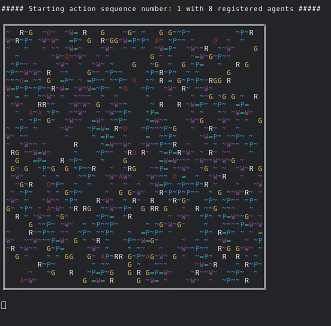

# wumpusMonitor

[German README here](README.md)

The monitor generates and manages the game world. It provides an interface through which agents can register, report their state and retrieve information about their current position. The monitor also provides an HTTP endpoint that can be used to query the entire state of the world. An external software can use this data for visualization.


## Start

```
java -jar target/wumpusMonitor-[VERSION]-jar-with-dependencies.jar -b http://127.0.0.1:12345 -w wumpus://localhost:6666 -l warn
```

`-b` Base URL on which the HTTP server is listening.

`-w` URL to the agent -> monitor communication.

`-l` Log level [warn, info, debug, trace].


Optional parameters:


`-t` Throttle simulation per step by X milliseconds (default: 0).

`-r` Communication radius of agents (fields) (default: 0)

`-s` Duration of subscription phase in seconds (default: 5 seconds)

The monitor writes a log file to the directory from which it was started:
`wumpusMonitor.log`


## Output to command line

Example output of the monitor with 8 agents, a communication range of 2 fields and no throttling:





## HTTP REST-API

To request the current state of the world there is an HTTP endpoint: `http://[BASE-URL:PORT]/wumpus/worldstate`.

A simple query can be done with `curl`:

If the status code **204 No Content** comes back, the monitor is still in the *subscription-phase* and the world has not been generated yet.

### Requests to the endpoint

#### 1st option: uncompressed (m2m).

Uncompressed JSON object, for a 32x32 field size: about 47 KiB

```
curl -H "accept: application/json" 'http://127.0.0.1:12345/wumpus/worldstate'
```

[sample result](samples/sample_world_state.json)

#### 2nd possibility: uncompressed (m2h)

More readable for a human, for a 32x32 field size: about 67 KiB

```
curl -H "accept: application/json" 'http://127.0.0.1:12345/wumpus/worldstate?human=true'
```

[sample result](samples/sample_world_state_hr.json)


#### 3rd option: gzip compressed (m2m)

GZIP compressed JSON object, for a 32x32 field size: < 1 KiB

```
curl -H "accept: application/json" -H "accept-encoding: gzip" 'http://127.0.0.1:12345/wumpus/worldstate'
```

[sample-result](samples/sample_world_state.json.gzip)

